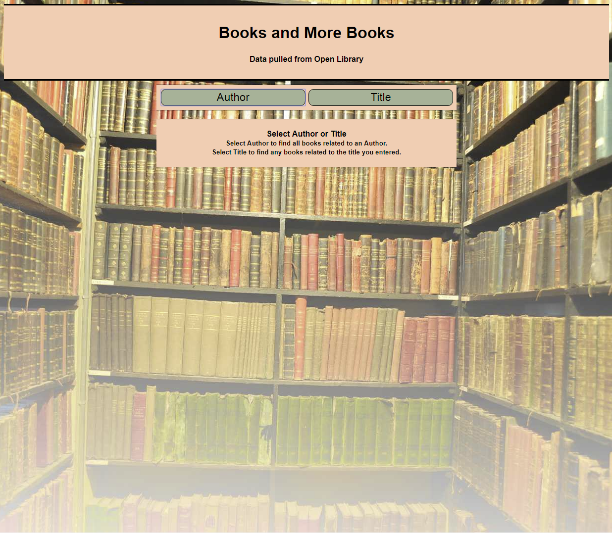
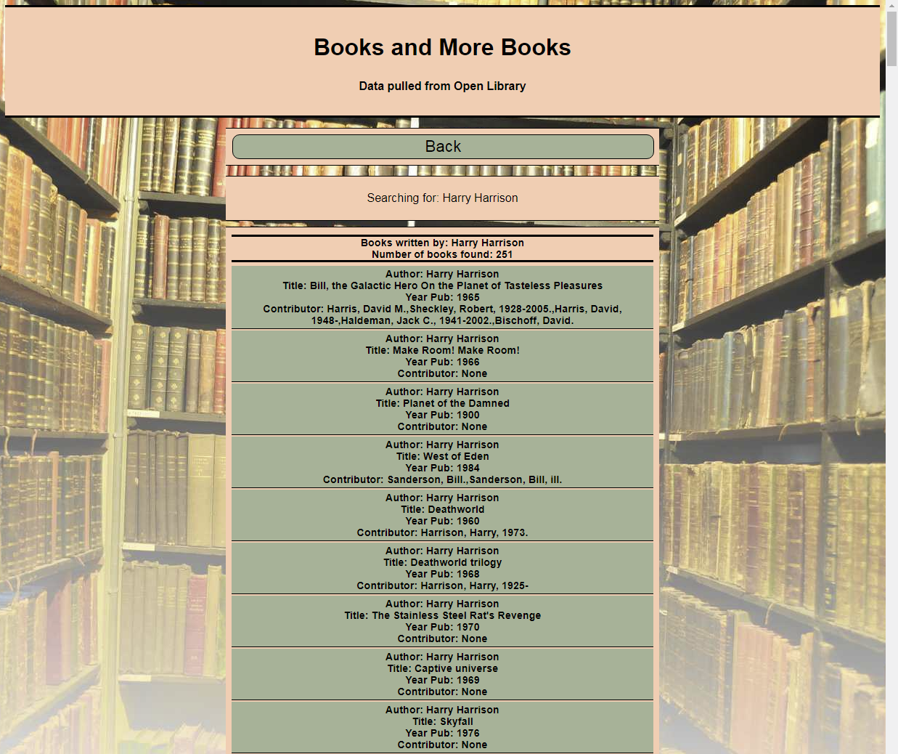

# Book Search

## [Link to the Book Search application](https://briancharapata.github.io/booksearch/)

## Application Screen Shots

This title page is the first page seen in the app.  You may choose to do either
lookups by Author or Book Title.  You will enter information on the next page.

Here is an example of an Author lookup of the author "Harry Harrison".  This 
listing is a list of all of "Harry Harrison's" books.  Each block will list
Author, Title of book, Year Published and Contributor's to the book if any.

## Summary of Application
The Book Search application can be used to search by author or Title of a book.  
When searching by Author you will select the 'Author' button then enter the
name of an author you wish to look up.  Your search by author will give you 
a listing of every book, which is known to the Open Library database, that
the author has published.

When searching by Title.  You will select the 'Title' button and then enter
the title you wish to search.  The title listing will give you all books
that have your search criteria.  The listing will list the author of each
book and other important data about each book.

## The Technical listing
+ Javascript
+ CCS
+ HTML
+ Accessing a JSON database 'Open Library'

## Possible Future Additions to Program
+ Add a second JSON database which will display possible book purchases.
+ Display small graphic of each book listed.
